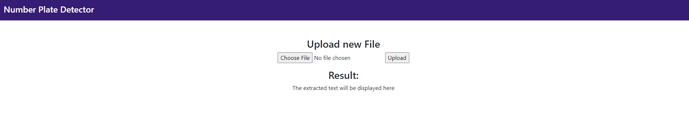
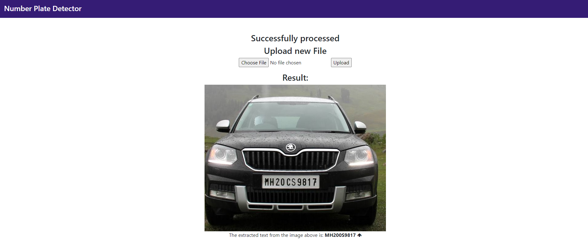

# Number-Plate-Recognition-System

### Built Using
* Python 3.6
* OpenCV 3.0.0
* Tesseract 

### Method
The algorithm makes use of image processing techniques like converting to grey-scale, resizing, contouring and denoising the image. As opposed to the computationally expensive technique of training an OCR model for text detection, the technique used in this project is less reliable but can be built in minimum time. Also, this algorithm might not produce results for some images. Given more time, this model can be enhanced using TensorFlow and OpenCV and can be used for plate detection and text detection.  

### Deployment
This application is deployed on AWS EC2 instance, [here](http://13.235.68.160:5500). To run on local machine, install the requirements and simply do `python app.py`, in case of Linux based computers. If using Windows, uncomment line 8 in `detect.py` and run.

### Application

